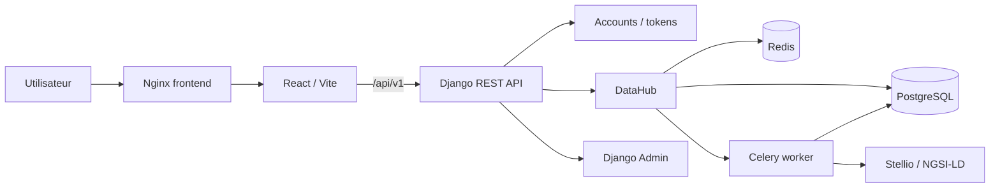
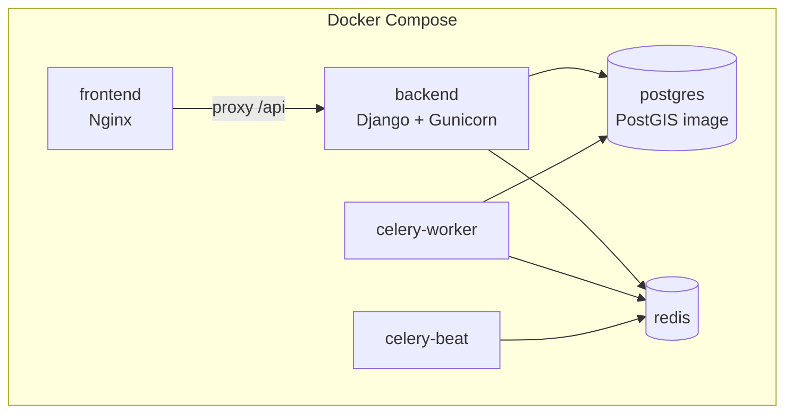
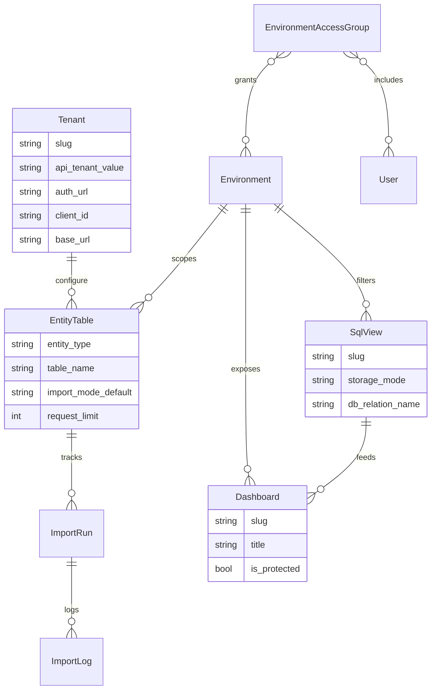
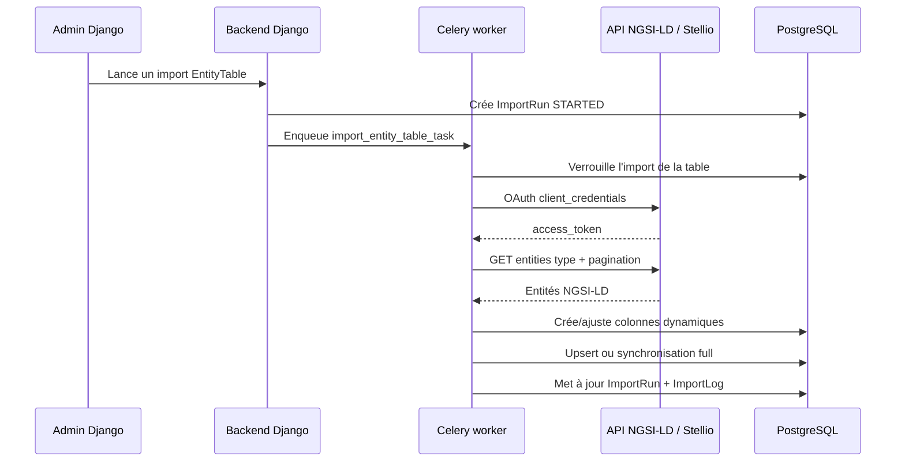

# Vitrine CEREMA

Application vitrine et démonstrateur data autour de projets CEREMA, avec une interface React et un backend Django orienté ingestion, stockage et exposition de données NGSI-LD/Stellio.

Le dépôt est organisé comme un monorepo :

- `frontend/` : application React/Vite, pages publiques, pages protégées et dashboards.
- `backend/` : API Django/DRF, authentification, administration et DataHub.
- `docs/` : notes d'architecture.
- `docker-compose.yml` : stack complète pour exécution locale ou VM.

## Vue D'Ensemble



L'application expose une partie vitrine accessible publiquement et des dashboards protégés par authentification. Le backend centralise l'accès aux sources NGSI-LD, importe les entités dans des tables relationnelles dynamiques, puis expose les données au frontend via des endpoints dashboard.

## Architecture Technique

### Frontend

Le frontend est une SPA React construite avec Vite et TypeScript.

- Routage : `react-router-dom`.
- Cartographie : `leaflet`.
- API client : `frontend/src/api/client.ts`.
- Authentification : token stocké dans `localStorage`, validation par `/api/v1/accounts/me/`.
- Build de production : fichiers statiques servis par Nginx.

Routes principales :

- `/` : accueil vitrine.
- `/projets`, `/projets/:slug` : pages projet côté frontend.
- `/carte` : visualisation cartographique.
- `/connexion` : connexion.
- `/dashboardhome` et `/dashboards/*` : espaces protégés.

### Backend

Le backend est une application Django 5 avec Django REST Framework.

- `apps.accounts` : login, logout, endpoint `me`, token DRF expirant.
- `apps.core` : santé applicative.
- `apps.datahub` : tenants, environnements, tables d'entités, imports, vues SQL, dashboards.
- `config.settings` : configuration par environnement, cache, base de données, Celery.

L'API est montée sous `/api/v1/`.

Endpoints structurants :

- `POST /api/v1/accounts/login/`
- `POST /api/v1/accounts/logout/`
- `GET /api/v1/accounts/me/`
- `GET /api/v1/datahub/tables/`
- `GET /api/v1/datahub/tables/{entity_type}/search/`
- `GET /api/v1/datahub/tables/by-name/{table_name}/rows/`
- `GET /api/v1/datahub/sqlviews/`
- `GET /api/v1/datahub/sqlviews/{slug}/rows/`
- `GET /api/v1/datahub/sqlviews/{slug}/geojson/`
- `GET /api/v1/dashboards/`
- `GET /api/v1/dashboards/{slug}/`
- `GET /api/v1/dashboards/{slug}/data/`
- `GET /api/v1/dashboards/{slug}/kpis/`
- `GET /api/v1/dashboards/{slug}/joined/`
- `GET /api/v1/dashboards/{slug}/map/`

### Infrastructure

La stack Docker démarre :

- `frontend` : Nginx + build React.
- `backend` : Django + Gunicorn.
- `celery-worker` : imports asynchrones.
- `celery-beat` : planification éventuelle.
- `postgres` : image PostGIS.
- `redis` : broker Celery et cache.



## Modèle Métier DataHub

Le DataHub sert à rendre exploitables des données NGSI-LD dans un contexte dashboard.



Concepts principaux :

- `Tenant` : configuration d'accès à une source NGSI-LD, avec URL OAuth, client id, tenant header, base URL et contexte JSON-LD.
- `Environment` : périmètre métier ou technique utilisé pour filtrer l'accès aux données.
- `EnvironmentAccessGroup` : rattache des utilisateurs à des environnements.
- `EntityTable` : décrit un type d'entité NGSI-LD à importer dans une table SQL dédiée.
- `ImportRun` et `ImportLog` : historisent les imports et leurs erreurs.
- `SqlView` : vue SQL ou vue matérialisée construite à partir des tables DataHub.
- `Dashboard` : interface métier alimentée par une `SqlView`.

## Flux D'Import NGSI-LD



Le backend privilégie une approche "backend first" pour les données sensibles : les secrets OAuth et l'accès NGSI-LD restent côté serveur, et le frontend consomme uniquement l'API interne.

## Choix Techniques

### React + Vite

Choisi pour livrer rapidement une SPA légère, avec un build simple et une bonne expérience de développement. Le frontend reste découplé de la logique d'ingestion, ce qui limite l'exposition des secrets et des contraintes NGSI-LD.

### Django + DRF

Django fournit l'admin, l'authentification, les migrations et un cadre robuste pour modéliser les objets métier. DRF permet d'exposer des endpoints lisibles et contrôlés pour le frontend.

### PostgreSQL / PostGIS

La stack utilise une image PostGIS afin de préparer les usages géographiques. Dans le code Django, le moteur configuré reste `django.db.backends.postgresql`, ce qui évite une dépendance locale forte à GDAL tout en conservant PostgreSQL comme socle de stockage.

### Tables Dynamiques Par Type D'Entité

Les entités NGSI-LD sont stockées dans des tables physiques dédiées (`EntityTable.table_name`). Le payload complet est conservé en `jsonb`, tandis que les attributs simples, relations et géométries utiles sont projetés en colonnes SQL.

Avantages :

- recherche et jointures SQL plus simples ;
- conservation du payload source ;
- adaptation à des schémas NGSI-LD variables.

Contreparties :

- évolution de schéma à contrôler ;
- dépendance à PostgreSQL ;
- besoin de gouvernance sur les noms de colonnes et de tables.

### Celery + Redis

Les imports sont asynchrones pour éviter de bloquer l'admin ou l'API. Redis sert à la fois au broker Celery, au backend de résultat et au cache/verrou d'import quand activé.

### Vues SQL Configurables

Les dashboards ne lisent pas directement toutes les tables brutes. Ils s'appuient sur des `SqlView`, qui peuvent être des vues classiques ou matérialisées. Le code limite volontairement les requêtes à des `SELECT` et restreint les relations sources aux tables DataHub ou vues déjà déployées.

## Choix Métier

- Centraliser l'accès Stellio/NGSI-LD côté backend pour sécuriser les secrets et uniformiser les règles de pagination, tenant et contexte.
- Organiser les données par tenant, environnement et type d'entité pour supporter plusieurs périmètres métier.
- Protéger les dashboards par groupes d'accès à des environnements.
- Conserver les données sources en `jsonb` afin de préserver la traçabilité et faciliter les réinterprétations ultérieures.
- Donner aux administrateurs Django la capacité de configurer les tenants, imports, vues SQL et dashboards sans redéploiement frontend.
- Préférer des endpoints dashboard stables au-dessus de vues SQL pour découpler l'interface des détails de stockage.

## Sécurité

Mesures présentes :

- Authentification par token DRF avec TTL configurable (`AUTH_TOKEN_TTL_SECONDS`).
- Limitation de débit DRF, dont un scope spécifique pour le login.
- Verrouillage anti-concurrence lors des imports d'une même `EntityTable`.
- Secrets NGSI-LD lus depuis les variables d'environnement.
- Accès aux tables, vues SQL et dashboards filtré par environnements utilisateur.
- Validation basique des identifiants SQL et restriction des requêtes `SqlView` à des `SELECT`.

Points de vigilance :

- Le token est stocké dans `localStorage`, pratique pour une SPA mais exposé en cas de XSS.
- La validation SQL est défensive mais ne remplace pas une revue stricte des vues créées en admin.
- Les endpoints publics et protégés doivent rester alignés entre frontend et backend.

## Points Forts

- Architecture claire entre présentation, API, ingestion et stockage.
- Backend extensible grâce à Django Admin pour piloter les sources et dashboards.
- Import NGSI-LD robuste : retries HTTP, pagination, logs, annulation, verrouillage et modes `upsert`/`full`.
- Conservation du payload brut et projection SQL des attributs utiles.
- Déploiement Docker complet avec services persistants.
- Préparation aux usages géographiques via Leaflet côté frontend et PostGIS côté infra.

## Limites Actuelles

- Certains appels du client frontend référencent encore des endpoints historiques (`/projects/`, `/geodata/segments/`) qui ne sont pas montés dans `config.api_urls.py` dans l'état actuel du backend.
- Le README précédent mentionnait des modules `projects`, `dashboards` et `geodata` séparés, alors que le code actuel concentre les dashboards dans `apps.datahub`.
- Les KPIs dashboard retournent aujourd'hui des métriques génériques basées principalement sur le nombre de lignes de la vue SQL.
- La création dynamique de colonnes peut produire une dette de schéma si les sources NGSI-LD changent fréquemment.
- La stack de test est minimale : il n'y a pas encore de CI visible ni de couverture automatisée significative.
- Le stockage géographique reste majoritairement JSON/GeoJSON ; les capacités PostGIS ne sont pas encore pleinement exploitées par les modèles Django.
- L'entrypoint Docker contient encore des références à des fixtures `apps/dashboards` et `apps/projects` qui ne correspondent pas à la structure actuelle.

## Points D'Amélioration

- Réaligner le contrat frontend/backend : soit restaurer les endpoints `projects` et `geodata`, soit retirer/adapter les appels frontend.
- Ajouter une suite de tests ciblée : auth, permissions par environnement, imports NGSI-LD, déploiement de vues SQL, endpoints dashboard.
- Ajouter une CI avec lint frontend, build TypeScript, tests Django et vérification Docker.
- Déplacer le token d'auth vers un mécanisme plus résistant aux XSS si le contexte sécurité l'exige.
- Exploiter PostGIS pour indexer et requêter les géométries au lieu de rester uniquement sur du GeoJSON.
- Versionner les contrats d'API et documenter les schémas de réponses.
- Ajouter une politique de rotation des secrets et de gestion multi-tenant plus explicite.
- Mettre en place des métriques d'exploitation : durée d'import, taux d'erreur, fraîcheur des données, volume par tenant.

## Lancement Local

### Backend seul

```powershell
cd backend
python -m venv .venv
.\.venv\Scripts\activate
pip install -r requirements.txt
python manage.py migrate
python manage.py createsuperuser
python manage.py runserver
```

API locale : `http://127.0.0.1:8000/api/v1/`

### Frontend seul

```powershell
cd frontend
npm install
npm run dev
```

Frontend local : `http://localhost:5173`

En développement, Vite proxy `/api` vers `http://127.0.0.1:8000`.

### Stack complète Docker

Préparer `backend/.env` à partir de `backend/.env.example`, puis lancer :

```bash
docker compose up -d --build
```

Services exposés :

- Frontend : `http://localhost:8080`
- Backend : `http://localhost:18000`
- API via frontend : `http://localhost:8080/api/v1/`

Commandes utiles :

```bash
docker compose ps
docker compose logs -f backend
docker compose logs -f celery-worker
docker compose down
```

## Configuration Importante

Variables backend principales :

- `DJANGO_SECRET_KEY`
- `DJANGO_DEBUG`
- `DJANGO_ALLOWED_HOSTS`
- `CORS_ALLOWED_ORIGINS`
- `DB_ENGINE`
- `POSTGRES_HOST`, `POSTGRES_PORT`, `POSTGRES_DB`, `POSTGRES_USER`, `POSTGRES_PASSWORD`
- `USE_REDIS_CACHE`
- `REDIS_URL`
- `CELERY_BROKER_URL`
- `CELERY_RESULT_BACKEND`
- `AUTH_TOKEN_TTL_SECONDS`
- `NGSILD_AUTH_URL`
- `NGSILD_CLIENT_ID`
- `NGSILD_CLIENT_SECRET`
- `NGSILD_BASE_URL`
- `NGSILD_CONTEXT_LINK`

Variable frontend principale :

- `VITE_API_BASE_URL`, par défaut `/api/v1`.

## Arborescence Résumée

```text
.
├── backend/
│   ├── apps/
│   │   ├── accounts/
│   │   ├── core/
│   │   └── datahub/
│   ├── config/
│   ├── Dockerfile
│   └── requirements.txt
├── frontend/
│   ├── src/
│   │   ├── api/
│   │   ├── components/
│   │   ├── layouts/
│   │   ├── pages/
│   │   └── styles/
│   ├── Dockerfile
│   └── package.json
├── docs/
├── docker-compose.yml
└── README.md
```

